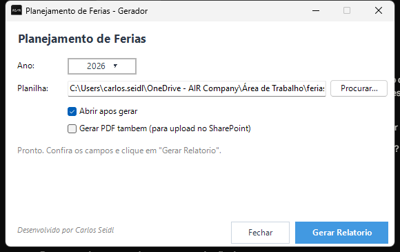

# Manual do Usuario - Planejamento de Ferias

Este manual descreve o fluxo completo, do download ate gerar o relatorio HTML.
Voce nao precisa saber programar para usar.

---

## 1. Instalacao (so na primeira vez)

### 1.1 Baixar o pacote

Abrir no navegador:

> https://github.com/ceseidl/FeriasAutomacao/releases/latest

Clicar em **`FeriasAutomacao-latest.zip`** para baixar.

### 1.2 Extrair o ZIP

1. Clicar com botao direito no ZIP -> **Extrair tudo...**
2. Escolher uma pasta fixa (sugestao: `Documentos\FeriasAutomacao`)
3. NAO usar o ZIP direto pelo Windows Explorer - **precisa extrair primeiro**

### 1.3 Conferir o conteudo

Apos extrair, a pasta deve ter:

```
Gerar Relatorio.lnk    <- atalho com o icone da palmeira (e o que voce vai usar)
Gerar Relatorio.bat    <- alternativa ao atalho, se o .lnk nao funcionar
ferias-2026.xlsx       <- planilha que voce vai editar
gui.ps1                <- nao precisa abrir
executar.ps1           <- nao precisa abrir
README.md
LICENSE
assets/                <- design e icone
bin/                   <- instalador do Pandoc
docs/                  <- este manual e screenshots
template.md            <- nao precisa abrir
```

> **Importante:** na primeira execucao, o app instala o **Pandoc** automaticamente
> (a partir de `bin/pandoc-installer.msi` ou via winget). Pode demorar 1-2 minutos
> da primeira vez. Nas execucoes seguintes, abre na hora.

---

## 2. Preencher a planilha de ferias

Abrir `ferias-2026.xlsx` no Excel.

### 2.1 Aba

A planilha deve ter uma aba chamada **`Ferias`** (e dela que o app le os dados).

### 2.2 Colunas obrigatorias

| Coluna        | Tipo     | Exemplo                          |
|---------------|----------|----------------------------------|
| `Mes`         | texto    | `Janeiro`, `Fevereiro`, `Marco`  |
| `Colaborador` | texto    | `Joao Silva`                     |
| `Squad`       | texto    | `Pedido/OMS - Integracao`        |
| `Inicio`      | data     | `15/01/2026`                     |
| `Fim`         | data     | `29/01/2026`                     |
| `Dias`        | numero   | `15`                             |
| `Status`      | texto    | `Aprovada`, `Solicitada`, `Planejada` |

### 2.3 Regras

- **Datas** no formato `dd/MM/yyyy`
- **Status** so aceita 3 valores: `Aprovada`, `Solicitada`, `Planejada`
- Uma linha por colaborador, por periodo de ferias
- Nao deixar linhas em branco no meio dos dados
- Salvar e **fechar a planilha antes** de gerar o relatorio (Excel trava o arquivo)

---

## 3. Gerar o relatorio

### 3.1 Abrir o app

Duplo-clique em **`Gerar Relatorio.lnk`** (icone da palmeira).

A janela vai abrir assim:



### 3.2 Conferir/ajustar os campos

A tela tem **3 controles**:

1. **Ano** - ano que aparece no titulo do relatorio e no Gantt.
   Padrao = ano atual. Pode subir/descer com as setas ou digitar.

2. **Planilha** - caminho da planilha. Ja vem preenchido com a planilha
   `ferias-2026.xlsx` da propria pasta. Se quiser usar outra, clicar em
   **Procurar...** e selecionar.

3. **Abrir HTML apos gerar** - se marcado, o navegador abre automaticamente
   com o relatorio quando termina. Sugestao: deixar marcado.

### 3.3 Clicar em "Gerar Relatorio"

- O cursor vira **ampulheta**
- Aparece uma **barra de progresso** azul animada
- O texto muda para *"Gerando relatorio... Aguarde..."*

Pode levar de **5 segundos** (planilha pequena, Pandoc ja instalado) a
**2 minutos** (primeira execucao, instalando Pandoc).

> Atalhos: **Enter** = Gerar, **Esc** = Fechar.

### 3.4 Resultado

Quando termina:

- O texto fica verde: *"Sucesso! Arquivo gerado: Ferias-yyyyMMdd-HHmmss.html"*
- Se a checkbox estava marcada, o HTML abre no navegador padrao

---

## 4. Onde estao os arquivos gerados

Cada execucao cria **2 arquivos** com timestamp na pasta `results\`:

```
results\
  Ferias-20260425-143012.md     <- versao Markdown (texto puro)
  Ferias-20260425-143012.html   <- versao HTML formatada (para enviar/imprimir)
```

- O **HTML** e standalone: voce pode anexar em e-mail, mandar pelo Teams,
  abrir em qualquer maquina com navegador. CSS e imagens estao embutidos.
- O Gantt usa **Mermaid** via internet (CDN) - precisa estar online quando
  voce **abrir** o HTML, mas nao quando gerar.

Como sao arquivos com timestamp, **nada e sobrescrito** - voce mantem o
historico de todas as versoes geradas.

---

## 5. O que tem dentro do relatorio

O HTML gerado tem 4 secoes:

### 5.1 Dashboard mensal
Tabela resumo: quantas pessoas estao em ferias por mes, em que squads,
e qual o status geral.

### 5.2 Cronograma detalhado
Tabela com **uma linha por periodo de ferias** - quem, qual squad, datas,
quantidade de dias, status.

### 5.3 Gantt
Grafico de barras temporal mostrando todos os periodos de ferias do ano.
Renderizado pelo Mermaid no proprio navegador.

### 5.4 Rodape de autoria
Linha final no formato:

> *Criado e compilado por **Carlos Seidl** em 25/04/2026 as 14:30.*

---

## 6. Problemas comuns

| Problema | Solucao |
|---|---|
| **"Planilha nao encontrada"** | Conferir o caminho no campo Planilha. Tentar **Procurar...** e selecionar manualmente. |
| **Janela nao abre ao clicar no atalho** | Tentar `Gerar Relatorio.bat` no lugar do `.lnk`. |
| **Erro de execucao de script** (politica do PowerShell) | Abrir PowerShell como administrador e rodar: `Set-ExecutionPolicy -Scope CurrentUser -ExecutionPolicy RemoteSigned`. |
| **Acentos quebrados** no HTML (`é`, `ã`) | A planilha precisa estar salva em UTF-8. No Excel: Salvar como -> Workbook do Excel (`.xlsx`). |
| **HTML sem o Gantt** | O Gantt precisa de internet ao abrir o HTML (CDN do Mermaid). Se voce esta numa rede corporativa que bloqueia `cdn.jsdelivr.net`, o grafico nao carrega - mas o resto do relatorio funciona. |
| **Mensagem "Could not fetch resource ... certificate has unknown CA"** durante a geracao | Esperado em rede corporativa com proxy MITM. **NAO e erro** - o Mermaid carrega no navegador, fora do proxy, e funciona normal ao abrir o HTML. |
| **"ImportExcel falha ao instalar"** | Abrir PowerShell como administrador e rodar: `Install-Module ImportExcel -Scope CurrentUser -Force`. |
| **Pandoc nao instalou** | Instalar manualmente em https://pandoc.org/installing.html. Reiniciar o app. |

---

## 7. Trocar o nome do autor

O nome **"Carlos Seidl"** aparece em 2 lugares: rodape do HTML + label da janela.
Para trocar de pessoa:

1. Abrir `gui.ps1` no Bloco de Notas
2. Editar a linha do topo:

```powershell
$AUTOR_FIXO = 'Carlos Seidl'
```

3. Trocar para o nome desejado e salvar
4. Pronto - todas as proximas execucoes usam o novo nome

---

## 8. Atualizar para uma versao nova

Quando sair uma versao nova no GitHub:

1. Baixar de novo o `FeriasAutomacao-latest.zip`
2. Extrair em **outra pasta** (nao por cima da antiga)
3. Copiar a sua `ferias-2026.xlsx` da pasta antiga para a nova
4. Apagar a pasta antiga
5. Continuar usando o atalho da pasta nova

> A pasta `results\` da versao antiga voce pode preservar se quiser manter
> o historico de relatorios gerados.

---

## 9. Suporte

Duvidas, bugs ou sugestoes:

- Repositorio: https://github.com/ceseidl/FeriasAutomacao
- Abrir uma **Issue** com print da tela e a mensagem de erro

---

*Manual mantido junto do codigo em `docs/MANUAL.md`. A cada nova versao
do app, o manual e atualizado e empacotado no ZIP.*
